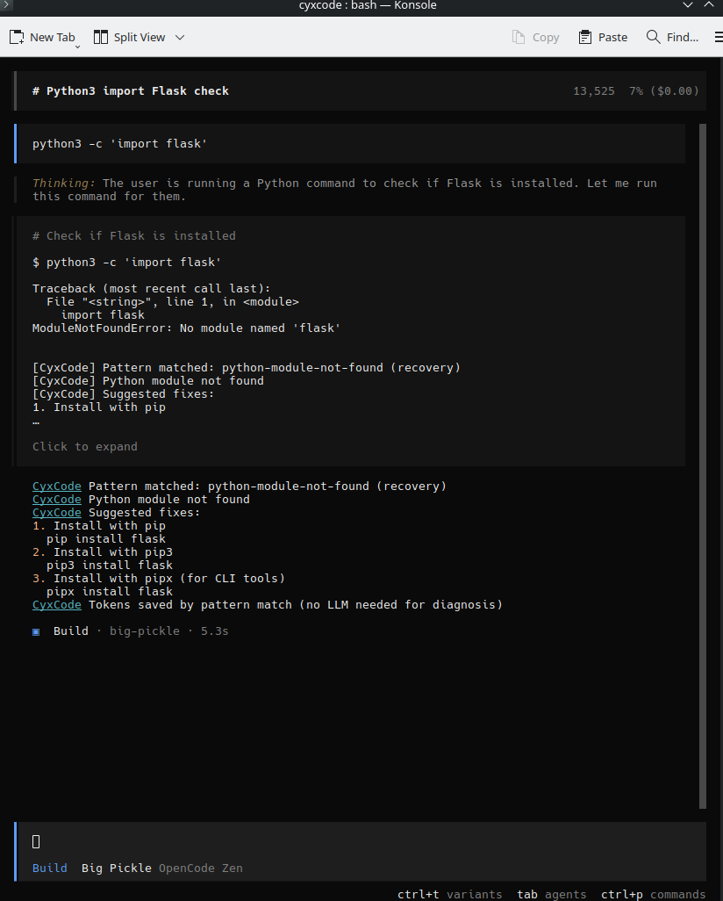
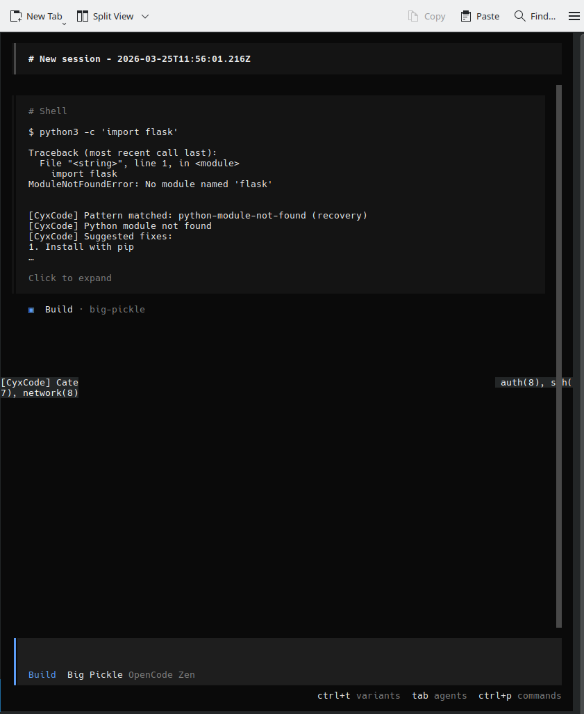
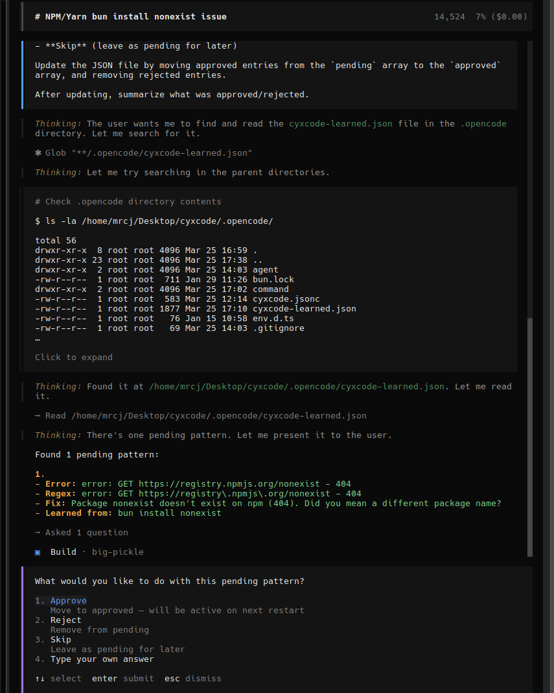
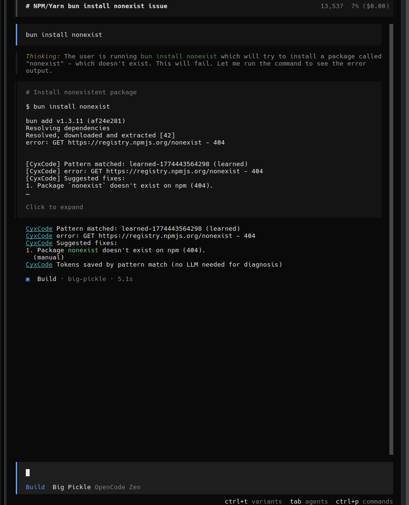
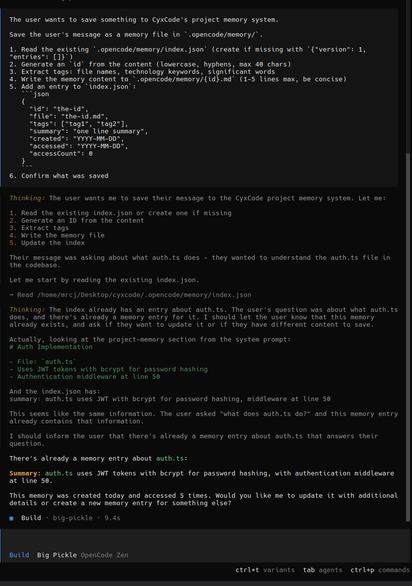
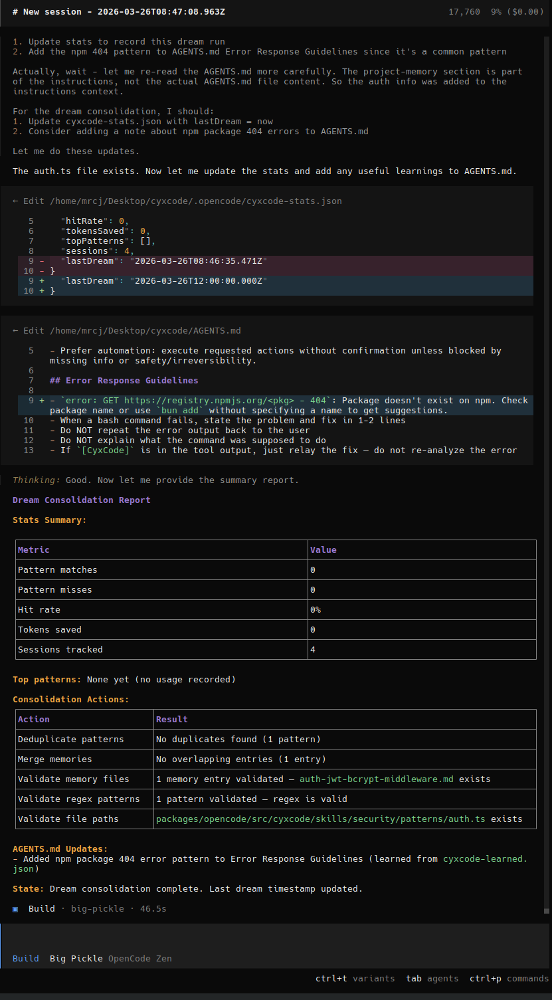

# CyxCode

*We automate the AI that automates us.*

[](https://github.com/code3hr/cyxcode)

136 error patterns. Zero tokens. The AI pays once, CyxCode remembers forever.

---

## Table of Contents

- [What is CyxCode?](#what-is-cyxcode)
- [Quick Start](#quick-start)
- [Two Modes](#two-modes)
- [Pattern Learning](#pattern-learning)
- [Project Memory](#project-memory)
- [Dream Consolidation](#dream-consolidation)
- [Supported Categories](#supported-categories)
- [Environment Variables](#environment-variables)
- [Why Fork?](#why-fork-opencode-instead-of-building-a-plugin)
- [Docs & User Guide](#docs)
- [Roadmap](#roadmap)

---

## What is CyxCode?

CyxCode is a fork of [OpenCode](https://opencode.ai) that intercepts known errors **before** the LLM sees them. 136 regex patterns match common errors and provide instant fixes — for free.

```
Traditional AI:  Every error -> LLM -> tokens burned -> response
CyxCode:         Every error -> Pattern check -> match? -> FREE fix
                                               -> no match? -> AI learns it
```

When no pattern matches, the AI handles it normally — but CyxCode **captures the error + fix** and generates a new pattern. Next time, that error is free. The pattern library grows automatically.

---

## Quick Start

```bash
git clone https://github.com/code3hr/cyxcode.git
cd cyxcode
bun install
export ANTHROPIC_API_KEY=sk-ant-...   # or OPENAI_API_KEY
bun run dev
```

For CPUs without AVX2, see [AVX2 Note](docs/PERFORMANCE.md#avx2-note).

---

## Two Modes

### Shell Mode (`!` prefix) — Zero Tokens



```
!python3 -c 'import flask'
  -> Runs directly (no AI)
  -> CyxCode matches pattern
  -> Fix displayed instantly
  -> Tokens: ZERO
```

### Normal Mode — AI + Short-Circuit

```
python3 -c 'import flask'
  -> AI thinks "let me run this" (LLM Call #1)
  -> CyxCode matches -> LLM Call #2 SKIPPED
  -> Tokens saved: ~800-1600 per error
```

| Mode | LLM Calls | Tokens | Time | Cost |
|------|-----------|--------|------|------|
| Shell (`!`) + match | **0** | **0** | instant | **$0.00** |
| Normal + match | 1 | ~600 | ~3-5s | ~$0.001 |
| Normal + no match | 2 | ~1,200 | ~5-8s | ~$0.002 |

---

## Pattern Learning

When CyxCode misses a pattern, the AI handles it. But CyxCode **learns from that interaction**:

1. AI handles the error (costs tokens once)
2. CyxCode captures the error output + AI's fix
3. Generates a regex pattern automatically
4. Saves to `.opencode/cyxcode-learned.json` as pending
5. Run `/learn-patterns` to review and approve

### Reviewing Learned Patterns (`/learn-patterns`)



Run `/learn-patterns` to review pending patterns. Each shows the error, generated regex, fix, and source command. Approve to activate, reject to discard, or skip for later.

### Learned Pattern in Action



The screenshot shows a bun 404 error being caught by a **learned** pattern. This error was handled by the AI the first time (costing tokens). CyxCode captured it, generated a pattern, and after approval via `/learn-patterns`, it now matches automatically — the AI is short-circuited and the fix is displayed directly.
6. Next time same error occurs -> **zero tokens**

**Every AI-handled error becomes an investment — that error never costs tokens again.**

---

## Project Memory

The AI forgets everything between sessions. CyxCode fixes that with **indexed project memory** — small files that load selectively based on what you're working on.

### Saving Memories (`/remember`)



Run `/remember` to save project knowledge. The AI detects duplicates, extracts tags, and stores compact 1-5 line memories in `.opencode/memory/`. Each memory has tags for relevance matching.

### How It Works

```
Session 1: /remember "auth.ts uses JWT with bcrypt, middleware at line 50"
           -> Saved to .opencode/memory/auth-jwt-bcrypt-middleware.md
           -> Tagged: [auth, jwt, bcrypt, middleware]

Session 2: "what does auth.ts do?"
           -> Memory auto-loaded (keyword "auth" matches tag)
           -> AI already knows: "JWT with bcrypt, line 50"
           -> Skips reading the file -> tokens saved
```

### Auto-Capture

Memories are also captured automatically when sessions compact. The compaction summary's "Discoveries" and "Relevant files" sections become indexed memories.

### Commands

| Command | Description |
|---------|-------------|
| `/remember <info>` | Save a memory manually |
| `/learn-patterns` | Review and approve learned error patterns |
| `/dream` | Consolidate memories, patterns, and stats |

---

## Dream Consolidation

CyxCode accumulates state over time — memories, patterns, stats. `/dream` cleans it up, like sleep for AI.

### `/dream` in Action



### Auto-dream (runs on startup, free — no tokens)
- Deduplicates learned patterns (removed 2→1 duplicate on first run)
- Merges overlapping memories
- Validates file existence and regex
- Persists router stats to `.opencode/cyxcode-stats.json`

### Manual `/dream` (AI-powered)
- All auto-dream phases plus smart merging
- Updates AGENTS.md with learnings from patterns and memories
- Reports: matches, misses, hit rate, tokens saved, sessions tracked

---

## Supported Categories

3 skills, 16 categories, 136+ patterns:

| Skill | Categories | Patterns |
|-------|-----------|----------|
| **Recovery** | Node, Git, Python, Docker, Build, System | 51 |
| **Security** | SSL, Auth, SSH, Network, Scan | 39 |
| **DevOps** | Kubernetes, Terraform, CI/CD, Cloud, Ansible | 46 |

Full pattern breakdown: [docs/ADDING-PATTERNS.md](docs/ADDING-PATTERNS.md)

---

## Environment Variables

| Variable | Default | Description |
|----------|---------|-------------|
| `CYXCODE_DEBUG` | `false` | Debug output (router state, learning) |
| `CYXCODE_SHORT_CIRCUIT` | `true` | Skip LLM on pattern match. `false` to always use AI |
| `ANTHROPIC_API_KEY` | — | Claude API key |
| `OPENAI_API_KEY` | — | OpenAI API key |
| `CYXCODE_SERVER_PASSWORD` | — | Server mode password |

---

## Why Fork OpenCode Instead of Building a Plugin?

Plugins can't do what CyxCode does:

1. **Short-circuit requires modifying the core loop** — plugins can't break the LLM loop
2. **Shell mode (`!`) has no plugin hook** — `SessionPrompt.shell()` is a core function
3. **Tool result metadata** — `cyxcodeMatched` flag requires bash tool internals
4. **Module initialization timing** — Bun's `--conditions=browser` needs imports in core files

Plugins decorate. CyxCode changes control flow. That requires a fork.

### A Note on Naming

CyxCode is a fork of [OpenCode](https://opencode.ai). You'll see `opencode` in some internal files — directory names (`.opencode/`, `packages/opencode/`) and internal code references. This is intentional.

A full rebrand of every internal reference would make it impossible to pull upstream improvements from OpenCode. We regularly sync with upstream to get new features, bug fixes, and TUI improvements. Renaming thousands of internal references would turn every `git pull` into a merge conflict nightmare.

What's been rebranded: the CLI (`cyxcode`), the TUI logo, the package scope (`@cyxcode/*`), feature flags (`CYXCODE_*`), config files (`cyxcode.jsonc`), database (`cyxcode.db`), and all documentation. The directory structure stays `opencode` internally for upstream compatibility.

If you see `opencode` in a directory path or source file, that's normal. If you see it in the UI or docs, that's a bug — please report it.

---

## Docs

| Document | Description |
|----------|-------------|
| **[User Guide](docs/USAGE.md)** | **Complete guide: all modes, commands, features** |
| **[FAQ](docs/FAQ.md)** | **Community questions answered: fork vs plugin, testing, maintenance** |
| [Adding Patterns](docs/ADDING-PATTERNS.md) | Step-by-step guide to adding custom patterns |
| [Contributing Patterns](docs/CONTRIBUTING-PATTERNS.md) | Community contribution guide, wanted categories |
| [Before/After Comparison](docs/BEFORE-AFTER.md) | Side-by-side: CyxCode vs standard AI |
| [Performance](docs/PERFORMANCE.md) | Benchmarks, token estimates, session savings |

### Running Modes

| Mode | Command | Description |
|------|---------|-------------|
| TUI (default) | `bun run dev` / `cyxcode` | Full-screen terminal UI |
| Server | `cyxcode serve --port 4096` | Headless API server |
| Web | `cyxcode web` | Browser-based UI |
| CLI | `cyxcode run "fix the bug"` | Non-interactive single message |
| Attach | `cyxcode attach http://localhost:4096` | Connect to running server |

### Agents

| Agent | Description |
|-------|-------------|
| **build** | Default, full-access agent for development work |
| **plan** | Read-only agent for analysis and exploration |
| **general** | Subagent for complex searches (`@general`) |

### Keyboard Shortcuts

| Key | Action |
|-----|--------|
| `!` | Shell mode (run command directly, no AI) |
| `Tab` | Switch agents |
| `Ctrl+T` | Switch model variants |
| `Ctrl+P` | Command palette |
| `PageUp/Down` | Scroll |

### Security Dashboard

Available at `http://localhost:4096/dashboard` when running in web/server mode. See [docs/PENTEST.md](docs/PENTEST.md) for full API reference.

---

## Roadmap

| Phase | Focus | Status |
|-------|-------|--------|
| 1-6 | Skill system, router, 136 patterns, bash integration | **Done** |
| 7 | Debug mode (`CYXCODE_DEBUG`) | **Done** |
| 8 | LLM short-circuit on pattern match | **Done** |
| 9 | Shell mode (`!`) zero-token matching | **Done** |
| 10 | Capture substitution (`$1` -> actual values) | **Done** |
| 11 | Pattern learning system | **Done** |
| 12 | Indexed project memory (`/remember`) | **Done** |
| 13 | Dream consolidation (`/dream`) | **Done** |
| 14 | Persisted router stats across sessions | **Done** |
| 15 | Community patterns (Bun, Rust, Go, Ruby) | Planned |
| 16 | Auto-execute fixes (with approval) | Planned |

---

## License

MIT License — See [LICENSE](LICENSE)

---

**Tokens are the new currency. CyxCode makes sure you don't waste them.**

**CyxCode** — *We automate the AI that automates us.*
