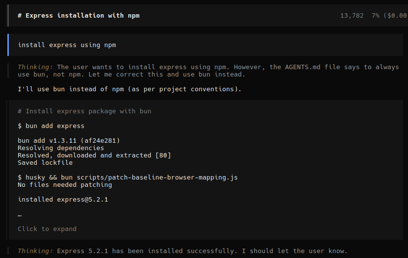
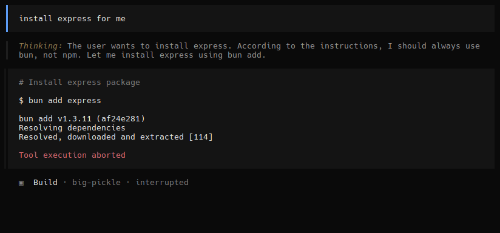
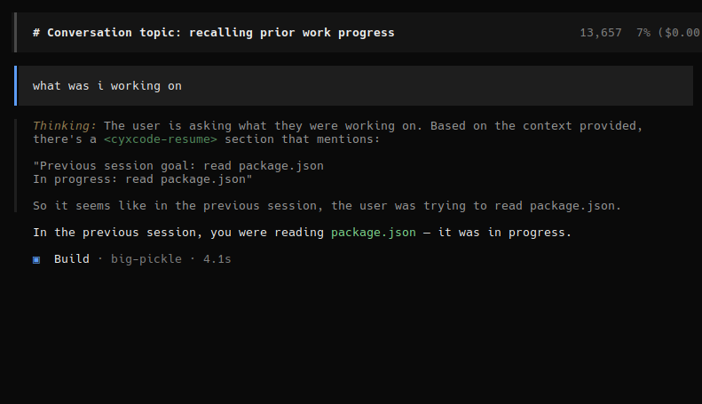

# CyxCode User Guide

*We automate the AI that automates us.*

---

## Quick Start

```bash
git clone https://github.com/code3hr/cyxcode.git
cd cyxcode
bun install
export ANTHROPIC_API_KEY=sk-ant-...   # or OPENAI_API_KEY
bun run dev
```

For CPUs without AVX2: install [bun baseline build](https://github.com/oven-sh/bun/releases) to `~/.bun/bin/`.

### Initialize AI State Tracking

```bash
cyxcode init           # Create .cyxcode/ in project root
cyxcode init --global  # Create ~/.cyxcode/ for cross-project state
```

This creates a `.cyxcode/` directory (like `git init` for AI state). Without `init`, CyxCode still works via `.opencode/` — `init` upgrades to the full three-tier system.

---

## Running Modes

| Mode | Command | Description |
|------|---------|-------------|
| **TUI** (default) | `bun run dev` or `cyxcode` | Full-screen terminal UI |
| **Server** | `cyxcode serve --port 4096` | Headless API server |
| **Web** | `cyxcode web` | Browser-based UI |
| **CLI** | `cyxcode run "fix the bug"` | Non-interactive single message |
| **Attach** | `cyxcode attach http://localhost:4096` | Connect to running server |

---

## Shell Mode (`!` prefix)

Type `!` to enter shell mode, then type a command. The command runs **directly without AI** — zero tokens.

If the command fails, CyxCode checks its 170+ patterns for a match. If matched, the fix is displayed instantly. No AI involved at all.

```
! python3 -c 'import flask'
  -> Runs directly (no AI)
  -> CyxCode pattern matches: python-module-not-found
  -> Fix: pip install flask
  -> Tokens: ZERO
```

---

## Agents

Switch agents with `Tab`:

| Agent | Description |
|-------|-------------|
| **build** | Default, full-access for development work |
| **plan** | Read-only for analysis and exploration |

Use `@general` in messages to invoke the subagent for complex searches.

---

## Commands

Type `/` followed by the command name:

| Command | Description |
|---------|-------------|
| `/dream` | Run dream consolidation — deduplicate, validate, persist stats, update AGENTS.md |
| `/remember <info>` | Save a memory about your project for future sessions |
| `/learn-patterns` | Review and approve learned error patterns |
| `/correct <rule>` | Save a behavioral correction for future sessions |
| `/diagnose` | Quick error diagnosis using a lightweight model |
| `/commit` | Git commit and push |
| `/learn` | Extract session learnings to AGENTS.md |
| `cyxcode audit` | Show recent audit events (CLI) |
| `cyxcode report` | Generate token savings report (CLI) |
| `cyxcode community list` | List installed community pattern packs |
| `cyxcode community install <path>` | Install a community pack from file or URL |
| `cyxcode community remove <name>` | Remove an installed community pack |
| `cyxcode community validate <path>` | Validate a community pack file |

---

## Pattern Matching

CyxCode intercepts errors **before** the AI processes them. 136+ built-in patterns across 16 categories, plus bundled community packs for Bun, Rust, Go, and Ruby:

| Skill | Categories |
|-------|-----------|
| **Recovery** | Node, Git, Python, Docker, Build, System |
| **Security** | SSL, Auth, SSH, Network, Scan |
| **DevOps** | Kubernetes, Terraform, CI/CD, Cloud, Ansible |

When a command fails:
1. CyxCode checks all patterns against the error output
2. **Match found** → Fix displayed, LLM skipped (`[CyxCode]` label visible)
3. **No match** → AI handles it, CyxCode learns from the interaction

### How to tell
- `[CyxCode]` in output = pattern matched, free fix
- No `[CyxCode]` = AI handled it (costs tokens)

---

## Pattern Learning

When CyxCode misses a pattern, the AI handles it. But CyxCode **captures the interaction**:

1. Error output + AI's fix are saved (`.cyxcode/patterns/learned.json` or `.opencode/cyxcode-learned.json`)
2. A regex pattern is auto-generated
3. Run `/learn-patterns` to review and approve
4. Approved patterns are active on next restart
5. **Same error = zero tokens forever**

---

## Project Memory

CyxCode remembers project knowledge across sessions via indexed memory files.

### Save memories
```
/remember auth.ts uses JWT with bcrypt, middleware at line 50
/remember --global this machine uses ~/.bun/bin baseline
```

### How it works
- Memories stored in `.cyxcode/memory/` (or `.opencode/memory/`) as small .md files (1-5 lines)
- Each memory has tags for keyword matching
- On new sessions, only **relevant** memories load (max ~500 tokens)
- Memories auto-captured from session compaction summaries
- **Global memories** in `~/.cyxcode/memory/` apply to all projects on the machine
- **Project memories** take priority over global when both match

### View memories
Check `.cyxcode/memory/index.json` (or `.opencode/memory/index.json`) for all stored entries.

---

## Dream Consolidation

CyxCode accumulates state over time. `/dream` cleans it up — like sleep for AI.

### Auto-dream (runs on startup, free)
- Deduplicates learned patterns
- Merges overlapping memories
- Validates file existence and regex
- Persists router stats

### Manual `/dream` (AI-powered)
- All auto-dream phases plus:
- Smart merging of related memories
- Updates AGENTS.md with new learnings
- Reports stats: matches, misses, hit rate, tokens saved

### Stats
Persisted to `.cyxcode/stats.json` (or `.opencode/cyxcode-stats.json`):
- Pattern matches/misses across sessions
- Hit rate
- Lifetime tokens saved
- Sessions tracked

---

## State Versioning

CyxCode tracks AI state across sessions — corrections, context, working files. Like git for AI behavior.

### Corrections (`/correct`)

Save behavioral rules the AI should always follow. Corrections persist across sessions and get stronger with reinforcement.

```
/correct always use bun, not npm
/correct --global keep responses under 3 lines
```

Project corrections override global ones. Global corrections (saved to `~/.cyxcode/corrections/`) apply across all projects.

The AI will follow the correction in future sessions:

**Before correction** — AI would use npm by default.

**After correction** — AI recognizes the rule and self-corrects:



The AI's thinking shows: *"According to the instructions, I should always use bun, not npm."* It overrides the user's `npm` request and uses `bun add` instead.

Even when explicitly asked to use npm, the correction takes priority:



### Resume

When you start a new session, CyxCode loads the previous session's context automatically — no need to re-explain what you were working on.



The AI reads the `<cyxcode-resume>` context and knows: *"In the previous session, you were reading package.json — it was in progress."*

### How it works

1. **Auto-commit**: State is saved after each session (goal, working files, progress)
2. **Corrections**: Saved via `/correct`, loaded into system prompt sorted by strength
3. **Resume**: HEAD commit loaded on session start — AI picks up where it left off
4. **Drift detection**: If AI stops following a correction, its strength increases automatically
5. **Dream integration**: Corrections with strength >= 3 auto-promoted to AGENTS.md. Unused corrections decay over time.

### Commands

| Command | Description |
|---------|-------------|
| `/correct <rule>` | Save a behavioral correction (strength: 1, increases on reinforcement) |
| `/dream` | Consolidate state — promote, decay, archive |
| `/history` | Show commit log and correction history |

---

## Multi-Agent Branching

When you spawn subagents (`@general`, Task tool), each gets an **isolated state branch** — like git branches for AI state.

### How It Works

1. **Branch creation**: When a subagent spawns, CyxCode creates a branch from the current HEAD
2. **Isolated commits**: Subagent's state commits go to its branch, not main
3. **Auto-merge**: When subagent completes, branch merges back via three-way merge
4. **Discovery propagation**: New discoveries from subagents automatically merge to main

### Example Flow

```
Main session: HEAD = commit_abc
  |
  +-- @general "find all API endpoints"
        |
        Branch: session_xyz (base: commit_abc)
        Commits to branch HEAD
        Discovers: "API uses Express router at /api/*"
        |
        Subagent completes
        |
        Three-way merge -> main HEAD updated
        Discovery added to main state
```

### Merge Strategy

| Field | Strategy |
|-------|----------|
| goal | Keep main (subagent works on subtask) |
| workingFiles | Union of all |
| discoveries | Append branch to main (cap at 10) |
| completed | Union of all |
| activeMemories | Union of all |
| activePatterns | Union of all |

### Storage

```
.cyxcode/history/
  branches/{sessionID}.json   # Branch refs (status, HEAD, base)
  merges/{mergeHash}.json     # Merge records (conflicts, discoveries)
```

### Branch Lifecycle

- **active**: Subagent running, accepting commits
- **merged**: Subagent completed, state merged to main
- **abandoned**: Subagent crashed or cancelled

Old merged/abandoned branches are garbage collected after 7 days.

---

## Audit System

CyxCode tracks every pattern match, correction, and drift event. Generate reports to see token savings and efficiency.

### CLI Commands

```bash
# Show recent audit events
cyxcode audit --last 1d

# Filter by event type
cyxcode audit --type cyxcode.pattern.match

# Generate token savings report (default: last 7 days)
cyxcode report

# Different time periods
cyxcode report --period 30d

# Different output formats
cyxcode report --format json
cyxcode report --format markdown
cyxcode report --format text
```

### Sample Report

```
+-------------------------------------------------------------+
|        CyxCode Token Report: 03-21 to 03-28                 |
+-------------------------------------------------------------+
|                                                             |
|  TOKEN SAVINGS                                              |
|  +-- Saved:     187,200 tokens ($0.37)                     |
|  +-- Used:       48,600 tokens ($0.10)                     |
|  +-- Efficiency: 79.4%                                      |
|                                                             |
|  PATTERNS                    CORRECTIONS                    |
|  +-- Matches: 847            +-- Added:    12               |
|  +-- Misses:  203            +-- Promoted: 4                |
|  +-- Hit Rate: 80.7%         +-- Drift:    7                |
|  +-- Learned: 12             +-- Compliance: 94%            |
|                                                             |
+-------------------------------------------------------------+
```

### Web Dashboard

Launch the web server to access the dashboard:

```bash
# Start web mode (opens browser automatically)
cyxcode web

# Or start server mode (headless)
cyxcode serve --port 4096

# Then open in browser
open http://localhost:4096/dashboard/tokens
```

The Tokens page at `/dashboard/tokens` shows:
- Token savings cards (saved, cost, hit rate)
- Pattern statistics (matches, misses, learned)
- Correction statistics (added, promoted, drift)
- Top performing patterns
- Recent audit events

### Event Types

| Event | Description |
|-------|-------------|
| `pattern.match` | Pattern matched, tokens saved |
| `pattern.miss` | No match, AI handled (tokens used) |
| `pattern.learned` | New pattern approved |
| `correction.added` | User ran `/correct` |
| `correction.promoted` | Strength >= 3, added to system |
| `drift.detected` | AI violated a correction |

### Privacy

All audit entries are automatically scrubbed of secrets (API keys, JWTs, passwords) before storage.

---

## Environment Variables

| Variable | Default | Description |
|----------|---------|-------------|
| `CYXCODE_DEBUG` | `false` | Debug output for pattern matching and learning |
| `CYXCODE_SHORT_CIRCUIT` | `true` | Skip LLM on pattern match. `false` to always use AI |
| `ANTHROPIC_API_KEY` | — | Claude API key |
| `OPENAI_API_KEY` | — | OpenAI API key |
| `CYXCODE_SERVER_PASSWORD` | — | Password for server mode |

---

## Keyboard Shortcuts

| Key | Action |
|-----|--------|
| `!` | Shell mode (run command directly) |
| `Tab` | Switch agents |
| `Ctrl+T` | Switch model variants |
| `Ctrl+P` | Command palette |
| `PageUp/Down` | Scroll |
| `Home` / `End` | Jump to first/last message |

---

## `cyxcode init` — Three-Tier State System

Run `cyxcode init` to create `.cyxcode/` — a dedicated directory for AI state, separate from `.opencode/` config.

### Three tiers

| Tier | Location | Scope | Priority |
|------|----------|-------|----------|
| **Project** | `.cyxcode/` in project root | This project only | Highest |
| **Global** | `~/.cyxcode/` in home dir | All projects on machine | Medium |
| **Community** | `~/.cyxcode/community/` | Downloaded pattern packs | Lowest |

### `cyxcode init`

```bash
$ cyxcode init

Initializing CyxCode...
  Created .cyxcode/
  Created .cyxcode/config.json
  Created .cyxcode/history/
  Created .cyxcode/memory/
  Created .cyxcode/patterns/
  Added .cyxcode/history/ to .gitignore
  Detected project type: node

CyxCode initialized. Ready to track AI state.
```

Options:
- `--global` — Initialize `~/.cyxcode/` for cross-project state
- `--no-migrate` — Skip automatic migration from `.opencode/`

### Migration

If `.opencode/` exists, `cyxcode init` automatically copies cyxcode-specific files to `.cyxcode/`:

| Source | Destination |
|--------|-------------|
| `.opencode/memory/` | `.cyxcode/memory/` |
| `.opencode/history/` | `.cyxcode/history/` |
| `.opencode/cyxcode-learned.json` | `.cyxcode/patterns/learned.json` |
| `.opencode/cyxcode-stats.json` | `.cyxcode/stats.json` |
| `.opencode/command/` | `.cyxcode/command/` |
| `.opencode/agent/` | `.cyxcode/agent/` |

Originals are kept (copy, not move). A `.cyxcode-migrated` marker prevents re-migration.

### Community patterns

CyxCode ships with bundled community packs for **Bun**, **Rust**, **Go**, and **Ruby**. These are automatically installed to `~/.cyxcode/community/` on first use.

**Manage community packs with CLI:**

```bash
# List installed packs
cyxcode community list

# Install from file or URL
cyxcode community install ./my-patterns.json
cyxcode community install https://example.com/patterns/elixir.json

# Remove a pack
cyxcode community remove bun-errors

# Validate pack format before sharing
cyxcode community validate ./my-patterns.json
```

**Pack format:**
```json
{
  "name": "bun-errors",
  "version": "1.0.0",
  "patterns": [
    {
      "id": "bun-registry-404",
      "regex": "error: GET https://registry\\.npmjs\\.org/\\S+ - 404",
      "category": "bun",
      "description": "Package not found in npm registry",
      "fixes": [{ "id": "check-name", "description": "Check package name for typos", "priority": 1 }]
    }
  ]
}
```

### Loading order at startup

1. Built-in patterns (136, from source code)
2. Community patterns (`~/.cyxcode/community/`)
3. Global learned patterns (`~/.cyxcode/patterns/learned.json`)
4. Global corrections (`~/.cyxcode/corrections/`)
5. Global memories (`~/.cyxcode/memory/`)
6. Project learned patterns (`.cyxcode/patterns/learned.json`)
7. Project corrections (`.cyxcode/history/corrections/`)
8. Project memories (`.cyxcode/memory/`)

Project overrides global. Global overrides community.

### Without `init`

CyxCode works without `init` — all state saves to `.opencode/` (backward compatible). `init` upgrades to the structured `.cyxcode/` layout with global and community tiers.

---

## File Structure

### After `cyxcode init` (recommended)

```
.cyxcode/
  config.json               # Project config (type, created date)
  history/
    HEAD.json               # Latest commit pointer
    commits/                # State snapshots
    corrections/            # Behavioral rules
    changelog.json          # Event log
  memory/
    index.json              # Memory index (tags, summaries)
    *.md                    # Individual memories
  patterns/
    learned.json            # Learned error patterns (pending + approved)
  stats.json                # Persisted router stats
  agent/                    # Agent configs
  command/                  # Custom slash commands

~/.cyxcode/                 # Global tier (cyxcode init --global)
  config.json
  corrections/              # Global behavioral rules
  memory/                   # Global memories
  patterns/
    learned.json            # Global learned patterns
  community/                # Community pattern packs (*.json)
  stats.json
```

### Legacy (without init)

```
.opencode/
  memory/
    index.json              # Memory index (tags, summaries)
    *.md                    # Individual memories (1-5 lines each)
  cyxcode-learned.json      # Learned error patterns (pending + approved)
  cyxcode-stats.json        # Persisted router stats
  cyxcode.jsonc             # Project config
  command/                  # Custom slash commands
  agent/                    # Agent configs
```

---

## Adding Custom Patterns

See [Adding Patterns](ADDING-PATTERNS.md) for a step-by-step guide.

## Contributing

See [Contributing Patterns](CONTRIBUTING-PATTERNS.md) to add patterns for new tools/languages.

## Performance

See [Performance](PERFORMANCE.md) for benchmarks and token savings estimates.
